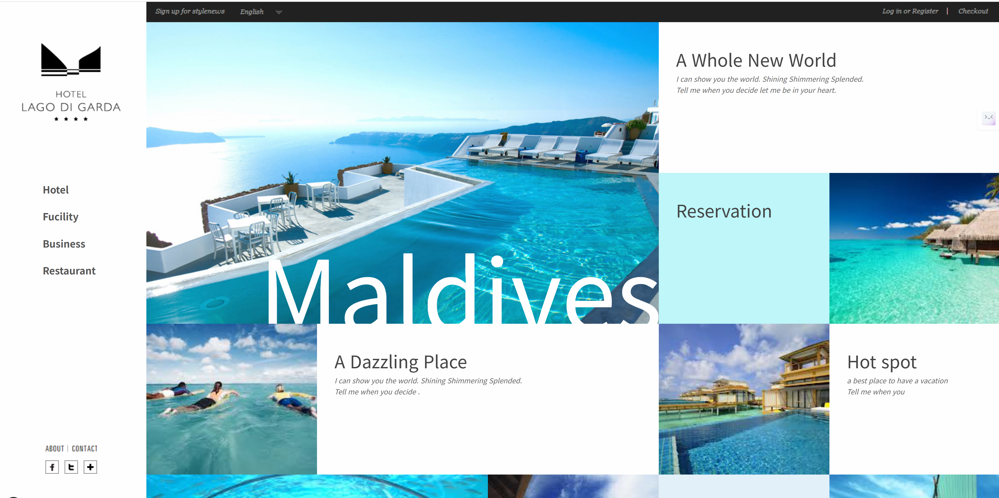

# Maldives250807
Maldives250807

https://aebonlee.github.io/Maldives250807/

반응형 사이트로 각 화면 크기에 맞춰서 레이아웃이 변경됩니다.

---

**화면의 폭에 따라 변하는 웹 레이아웃**

미디어쿼리를 이용하면 원하는 화면 폭을 자유롭게 설정하여 특정 화면 폭에서 원하는 CSS 구문을 다르게 적용하기 위한 연습 예제

**[사용된 필수 구문]**

① mediaquery : 화면의 해상도 폭에 따라 각각 다른 CSS 연결

② nth-child() : 여러 개의 콘텐츠 박스 들을 클래스의 추가 없이 각기 다르게 선택

③ box-sizing : 특정 요소의 padding과 border 값을 기존의 넓이 값과 높이 값에 포함

④ transition : 각각의 콘텐츠 박스에 마우스 오버 시, 전환 효과를 구현

⑤ 웹 폰트 아이콘 : 주 메뉴와 텍스트 박스 안의 아이콘을 생성

⑥ 구글 웹 폰트 : 텍스트 박스의 폰트를 꾸며 줌

⑦ animation : 페이지 로딩 시, 콘텐츠 박스의 모션을 구현

⑧ transform(2D)변형 : 주 메뉴와 텍스트 박스의 텍스트를 확대

---

**태그 사용가능여부 ([http://caniuse.com](http://caniuse.com/))**

**mediaquery : 화면의 해상도 폭에 따라 각각 다른 CSS 연결 (ie8,9,오페라 미니 사용불가)**

**nth-child() (ie8 버전 불안)**

**box-sizing (모든 버전 가능)**

**transition (ie 8, 9, 10, 오페라 미니 사용불가)**

**웹 폰트 아이콘**

**구글 웹 폰트**

**animation (ie 8, 9, 오페라 미니 사용불가)**

**transform(2D)변형(ie8,오페라 미니 사용불가)**

---

**<<사용되는 이미지 소스>>**

http://www.hotellagodigarda.it/

**<<해상도 범위>>**

**1. 1600px 이상**

**2. 1280~1599px**

**3. 1024*1279px**

**4. 780*1023px**

**5. 640*779px**

**6. 480*639px**

**7. 479px 이하**

---

- 준비작업

step1. 준비작업

step2. 가로 폭 1600px 이상에서의 기본 레이아웃 설정

step3. 미디어쿼리로 화면 폭마다 레이아웃 다르게 설정

step4. <header> 완성하기

step5. <nav>, <article> 콘텐츠 채워 넣기

step6. 특정 화면 폭에서 어색한 부분 수정하기

step7. 전체 코드 확인하기

---

<<경로설정하기>>

동일 경로에 위치한 파일 : . / 파일명.확장자

상위 경로에 위치한 파일 : ../ 파일명.확장자

**<<파일의 설명>>**

**1. custom.js**

**실제 예제를 통해 JavaScript/jQuery 코드 작성할 파일**

**2. jquery.easing.1.3.js**

**jQuery 를 이용한 모션의 가속도를 설정할 수 있는**

**플러그인 파일**

**3. jquery-2.1.1.min.js**

**jQuery 사용을 위한 핵심 파일**

**4. prefixfree.min.js**

**CSS3의 벤더프리픽스의 생략을 도와주는 플러그인 파일**

---

<< my_template >>

CSS 폴더 : style.css ( CSS reset 참고자료 http://blog.naver.com/kimsheep1030/220157403890 )

/* Reset CSS */

- { margin:0; padding:0;}

ol,ul { list-style: none; }

a { outline:0; text-decoration:none; color:#555; }

img { border:0;}

body { font:12px/1.6 arial; color:#555; }

---

JS 폴더 : custom.js

jquery.easing.1.3.js

jquery-2.1.1min.js

jquery-ui.min.js

prefixfree.min.js

애니메이션 아이콘 : https://fontawesome.com/docs/web/style/animate

[**Animating Icons**
The internet's icon library + toolkit. Used by millions of designers, devs, & content creators. Open-source. Always free. Always awesome.
fontawesome.com](https://fontawesome.com/docs/web/style/animate)

---

CSS

p { color:white; font-size:20px; font-family:'Poiret One';

position:absolute; right:200px;}

HTML

<marquee behavior="alternate" scrollamount="10" scrolldelay="10"

width="700" height="38" direction="left" loop="-1">

Welcome to My Homepage~

Have a nice day! *^^* </marquee>

---

step1. 준비작업

<meta name="viewport" content="width=device-width, initial-scale=1.0"/>

흔히 '뷰포트'라고 불리는 메타 태그로 모바일기기에서 웹 화면을 출력할때 모바일기기의 물리적인 화면 폭을 웹 화면 폭을 웹 화면이 인식할 수 있도록 하기 위한 태그

<link href="http://maxcdn.bootstrapcdn.com/font-awesome/4.1.0/css/font-awesame.min.css rel="stylesheet">

웹 아이콘을 적용하기 위한 외부 CSS 링크 파일

---

step2. 가로 폭 1600px 이상에서의 기본 레이아웃 설정

12개의 <article> 생성 / 컬러별 구분하기 위해 색상 선정 / 첫 번재 요소만 520px 지정

---

step3. 미디어쿼리로 화면 폭마다 레이아웃 다르게 설정

1280px ~ 1599px 구간 레이아웃 설정 : 12개 <article> 배열

1024px ~ 1279px 구간 레이아웃 설정 : 12개 <article> 배열

780px ~ 1023px 구간 레이아웃 설정 : 8개 <article> 배열

640px ~ 779px 구간 레이아웃 설정 : 8개 <article> 배열

480px ~ 639px 구간 레이아웃 설정 : 8개 <article> 배열

479px 이하 구간 레이아웃 설정 : 첫번째 <article> 만 선택하여 보임 처리

- @keyframes scale{

0%{transform:scale(0);}

100%{transform:scale(1);}

}

- animation 구문에서 횟수를 1로 지정, 처음 로딩시 한번 실행

---

step4. <header> 완성하기

- <header> 콘텐츠는 1600px 이상일 때와 이하일때의 가로배열 메뉴와 상단으로 위치 변경된 메뉴로 작성
- 로고 이미지도 2가지로 준비하여 변경시 호출
- 479px 이하에서는 각 메뉴에 padding로 모양을 잡아주어 모바일에서 이용하기 편하도록 구성

---

step5. <nav>, <article> 콘텐츠 채워 넣기

step6. 특정 화면 폭에서 어색한 부분 수정하기

step7. 전체 코드 확인하기